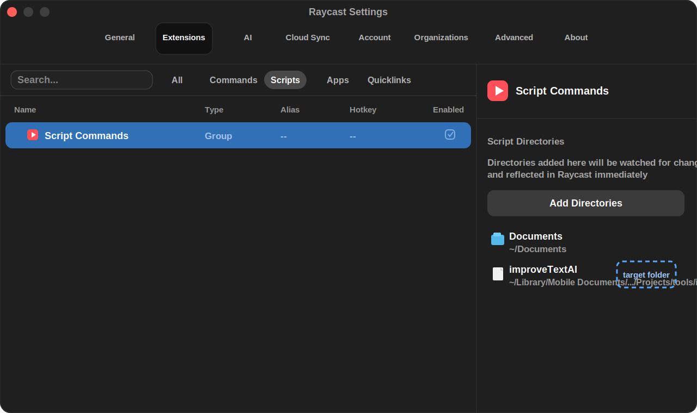

# improveTextAI

Improve selected text with Claude via a keyboard shortcut in any macOS app.

- Uses the [Anthropic Messages API](https://docs.anthropic.com/en/api/messages)
- Works in any native macOS app via the **Services menu**
- Works in **Electron apps** (WhatsApp, Slack, VS Code, etc.) via **Raycast**
- Plays a sound when it starts and when it's done
- Conservative rewriting: fixes grammar and spelling, preserves your tone and structure

## Requirements

- macOS
- An Anthropic API key in `ANTHROPIC_API_KEY` or `~/.config/anthropic/api_key`
- [Raycast](https://raycast.com) (optional, for global shortcut support in all apps)

## Install

```bash
bash install.sh
```

This installs the macOS Service under `~/Library/Services/`.
Run it again any time you move this project folder, because macOS stores the
current `service_runner.sh` path inside the generated Service.

If you do not already export `ANTHROPIC_API_KEY`, save it where the Service can read it:

```bash
mkdir -p ~/.config/anthropic
printf '%s' 'sk-ant-...' > ~/.config/anthropic/api_key
chmod 600 ~/.config/anthropic/api_key
```

## Raycast (global shortcut)

Add the project folder as a Script Commands directory in Raycast:

```text
/Users/davide/Library/Mobile Documents/com~apple~CloudDocs/Projects/tools/improveTextAI
```



Raycast configuration steps:

1. Open Raycast Settings.
2. Go to Extensions.
3. Select the Scripts tab.
4. Select Script Commands in the left list.
5. In the right panel, under Script Directories, click Add Directories.
6. Pick the `improveTextAI` project folder at the path shown above.
7. If the old `/Projects/improveTextAI` folder is still listed, remove it so
   Raycast does not keep running the moved copy.
8. Find the `improveTextAI` command in Raycast and set its hotkey to `Ctrl+\`.

For future LLMs helping with this project: Raycast does not need a specific
script file selected here. It watches directories. The correct setup is to add
the folder that contains `RaycastScript.sh`, `improve_text.sh`, and the helper
scripts. The screenshot/reference image shows the correct screen: Raycast
Settings → Extensions → Scripts → Script Commands, with `improveTextAI` listed
under Script Directories in the right panel.

> **Note:** Raycast needs Accessibility permission to simulate keystrokes.
> Go to Systemeinstellungen → Datenschutz & Sicherheit → Bedienungshilfen and add Raycast.

## How it works

1. Select any text
2. Press `Ctrl+\` (or right-click → Services → **Improve Text with AI** in native apps)
3. A sound plays while the model works
4. The selected text is replaced with the improved version

## Troubleshooting

If Raycast shows `Error: Process terminated with status 1`, check the log:

```bash
tail -20 ~/Library/Logs/improveTextAI.log
```

Common causes:

- **`HTTP 404 ... model: claude-...`** — the model ID in `improve_text.sh` was
  retired by Anthropic. Bump it to the current Sonnet (see Anthropic's
  [model deprecations](https://docs.anthropic.com/en/docs/about-claude/model-deprecations)).
  Prefer the family alias (e.g. `claude-sonnet-4-6`) over a dated snapshot so
  this doesn't recur.
- **`HTTP 401`** — `ANTHROPIC_API_KEY` is missing, expired, or unreadable by the
  Service. Re-save it under `~/.config/anthropic/api_key` (`chmod 600`).
- **`HTTP 429`** — rate limited; wait and retry.
- **No log entry at all** — Raycast is pointing at an old/moved copy of the
  project. Re-add this folder under Raycast → Script Directories and remove
  any stale entry.
